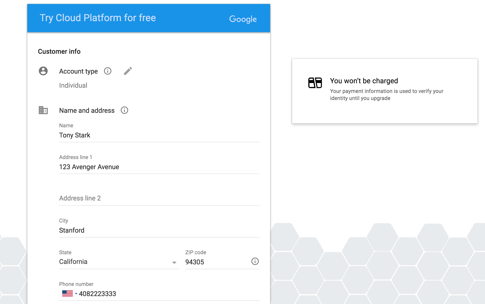
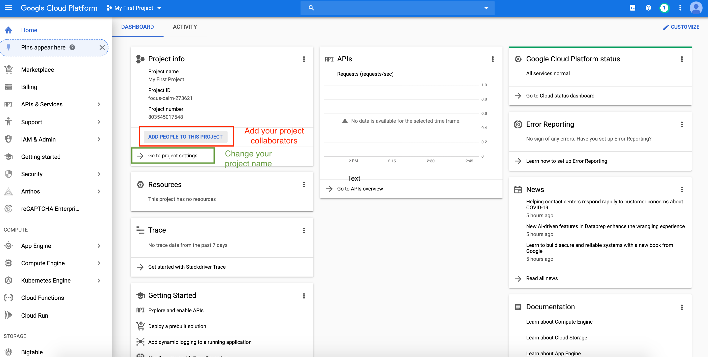

# Get started with Google Cloud Platform

## Reminder: STOP YOUR INSTANCES

We've put this reminder in the beginning to both emphasize the importance and to remind users first thing when they open the guide.

_**Stopping instances** is very important and can be done by clicking on the stop button at the top of the page showing your instances._ Otherwise, you **will run out of credits**. More details about this below.

## Overview

This section will explain the advantages of using Google Cloud Platform and introduce essential elements required. Information about how to shut down expensive components will also be discussed.

### Colab vs. GCP

While Colab is good for assignments, and is still a helpful and free tool for experimentation for your project, you will likely need a dedicated GPU instance when you start training on large datasets and collaborating as a team:

* Colab will disconnect after 12 hours or ~30 min of idling (and you will lose your unsaved data). A GCP VM instance will not disconnect untill you stop it (or run out of credits).

* A GCP VM instance's disk space allows you to deal with larger datasets. In Colab's case, you will have to save all your data and models to Google Drive.

* Colab does not innately support real-time collaboration.

* You can choose your GPU models and can set >1 GPUs for distributed training on GCP.

The ideal way is to use both efficiently, For example, use Colab to ensure that the model is converging before spinning up the GCP resources.

### Key elements of GCP

There are 3 basic elements in GCP to run a machine learning (ML) model: bucket, virtual machine (VM) and TPU.

#### Bucket

[A bucket](https://cloud.google.com/storage/docs/key-terms#buckets) is a stable storage space to store data.

#### Virtual Machine (VM)

A [VM](https://cloud.google.com/compute/docs/instances) is an **expensive** operating system. We run machine learning Python programs from our VM's. Virtual machines can read the data from buckets to build an ML model. We can store the results of our model to buckets.

#### TPU

[TPU](https://cloud.google.com/tpu/docs) is also **expensive**. When ML programs are run on VM's, the program uses TPU to accelerate computation for ML models.

### Shutting down expensive elements!

As mentioned, VM's and TPU's are expensive. So we should <span style="color:red">shut down</span> TPU and VM when  we're not using them.
*   We can shut them down using command lines or web interfaces manually. But we easily forget to do so.
*   We will provide instructions on shutting them down automatically by [a script below](#automatic-shutdown).

## Create and configure account

This section wil contain detailed procedures to sign up for the first time and configuring projects. Upgrading accounts and adding people to projects for collaboration will also be mentioned.

### Sign up to GCP for the first time

You should receive credits worth $300 from Google when you first sign up with your personal Gmail address and upgrade to a full account. Please use the resources judiciously.

1. Create Google Cloud account by going to the [Google Cloud homepage](https://cloud.google.com/?utm_source=google&utm_medium=cpc&utm_campaign=2015-q2-cloud-na-gcp-skws-freetrial-en&gclid=CP2e4PPpiNMCFU9bfgodGHsA1A "Title"). Click on the blue **Get Started for free** button. Sign into your Gmail account. Here is an illustrative example.


2. Choose **Account type** to be **Individual**. You will then fill in your name, address and credit card information.



3. Click the "Google Cloud Platform" (in red circle), and it will take you to the main project dashboard.


### Configure Your Project 

1. On the main project dashboard, you can change the name of your project by clicking **Go to project settings**.



2. To add project collaborators, click **ADD PEOPLE TO THIS PROJECT**. Add their email and make their role owners.


3. **Upgrade your account** in order to use GPUs by following these [instructions](https://cloud.google.com/free/docs/gcp-free-tier#how-to-upgrade). Otherwise [Google Cloud Free Tier](https://cloud.google.com/free/docs/gcp-free-tier#how-to-upgrade) does not come with GPU support or quota.


## Walk through a sample project

Based on [Training transformer on Cloud TPU (TF 2.x)](https://cloud.google.com/tpu/docs/tutorials/transformer-2.x), we provide the following instructions. We are going to:

* Create VM, bucket, TPU
* Run a ML program (training transformer) in VM, accelerated by TPU; store results to buckets
* Shut down TPU and VM automatically.

### Create a VM

#### Open a cloud shell window

From [here](https://console.cloud.google.com/?cloudshell=true&_ga=2.130633615.148565199.1589727540-1957719261.1589398391), you can open a cloud shell window and view the cloud console page at the same time.

#### Create a variable for your project's name

In the bash commands, please change `project-name` to the project ID displayed in the up left side of the console page.

```bash
export PROJECT_NAME=project-name
gcloud config set project ${PROJECT_NAME}
```

#### Create your own VM

Please pay attention to `zone`. Select a zone which is not used by too many people.

You can see what zones are used by other people by the following navigation: Console page -> Compute Engine -> “TPUs” in the left side bar -> zones.

You can see the set of zone names by the following navigation: Console page -> Compute Engine -> “Zones” in the left side bar. Pick up a name from here.


```bash
ctpu up --vm-only \
 --disk-size-gb=300 \
 --machine-type=n1-standard-8 \
 --zone=us-central1-b \
 --tf-version=nightly \
 --name=transformer-tutorial
```

Enter y to approve the creation of VM.

<a name="vm-zone"></a> Please remember the zone information in the above command `us-central1-b`. It will be used later when we create TPU.

Now the VM is created and started. The start of the VM triggers the start of charging fees, until the VM is shutdown.

Then use the following command to access the VM.

```bash
gcloud compute ssh transformer-tutorial --zone=us-central1-b
```

It will ask you to create a keyphrase for yourself. Just create one.


### Create a bucket

In the following command, please specify your own `bucket-name`

```bash
gsutil mb -p ${PROJECT_NAME} -c standard -l zone=us-central1 -b on gs://bucket-name
```


### Generate training dataset

#### Variables and directory

For the following command, please specify your own `bucket-name` that you just used.


```bash
export STORAGE_BUCKET=gs://bucket-name
export PARAM_SET=big
export GCS_DATA_DIR=$STORAGE_BUCKET/transformer/data
export MODEL_DIR=$STORAGE_BUCKET/transformer/model_$PARAM_SET
export PYTHONPATH=:/usr/share/models
export DATA_DIR=${HOME}/transformer/data
export VOCAB_FILE=${DATA_DIR}/vocab.ende.32768
```

#### Download and prepare the datasets

Download and process data in VM.

```bash
cd /usr/share/models/official/nlp/transformer
python3 data_download.py --data_dir=${DATA_DIR}
```

Move processed data from VM to bucket.

```bash
gsutil cp -r ${DATA_DIR} ${GCS_DATA_DIR}
```

A tutorial of using `gsutil` is [here](https://cloud.google.com/storage/docs/quickstart-gsutil)

We are using the codes pre-loaded into the VM, since they are already under `/usr/share/models/official/nlp/transformer`.


If we want to import outside codes into VM in the future (we don't have to do it now), here are some options:
*   [Upload files to VM](https://cloud.google.com/compute/docs/instances/transfer-files)
*   Use `git clone` to clone a Github repository
*   Upload codes from local drive to bucket. Then copy codes from bucket to VM


### Create TPU


```bash
ctpu up --tpu-only \
  --tpu-size=v3-8  \
  --zone=us-central1-b \
  --tf-version=nightly
```


Zone here should be the same as what you have set [at VM creation](#vm-zone).

After executing the command, TPU name will be the same as your VM’s name. Let’s also set it to environmental variable.


```bash
export TPU_NAME=transformer-tutorial
```

### Run the training script

By following command, the program in VM will read data from bucket to build train transformer model. Then the model results/checkpoints will be stored into bucket.

```bash
python3 transformer_main.py \
    --tpu=${TPU_NAME} \
    --model_dir=${MODEL_DIR} \
    --data_dir=${GCS_DATA_DIR} \
    --vocab_file=${GCS_DATA_DIR}/vocab.ende.32768 \
    --bleu_source=${GCS_DATA_DIR}/newstest2014.en \
    --bleu_ref=${GCS_DATA_DIR}/newstest2014.de \
    --batch_size=6144 \
    --train_steps=2000 \
    --static_batch=true \
    --use_ctl=true \
    --param_set=big \
    --max_length=64 \
    --decode_batch_size=32 \
    --decode_max_length=97 \
    --padded_decode=true \
    --distribution_strategy=tpu
```

Using the above command, we occupy one terminal in VM to run the Python program. However, it is better to let the program run at the backend of the VM, so you don’t need to maintain the SSH connection to VM all the time. The results can be printed in the log, or stored into VM or GCS buckets. [Later](#automatic-shutdown), we will explain how to combine Python and shutdown commands at the backend to achieve automatic shutdown.

### Manual shutdown of TPU and VM

#### By commnads
Then you can shut down TPU and VM manually by the following commands or by web interface.


```bash
ctpu pause --name=transformer-tutorial --zone=us-central1-b
gcloud compute instances stop transformer-tutorial --zone=us-central1-b
```

#### By web interface
You can also shutdown status of TPU and VM using the web console interface.

By this navigation: Console page -> Compute Engine -> “TPUs” in the left side bar, you can select "transformer-tutorial" and click "STOP". You should wait for around 3 minutes to make sure that "transformer-tutorial" **disappears** from this page.

By this navigation: Console page -> Compute Engine -> “VM instances” in the left side bar, you can select "transformer-tutorial" and click "STOP". You should wait for around 2 minutes to make sure that the status of "transformer-tutorial" becomes **grey** in this page.

### Automatic shutdown

It’s better to let the model run at the backend of the VM, so you don’t need to maintain the connection to VM all the time.

The results can be printed in the log, or stored into VM or GCS buckets.

What we are doing here is to put all commands we mentioned into a [bash script](https://www.cyberciti.biz/faq/how-to-execute-a-shell-script-in-linux/): demo.sh

```bash
#!/bin/bash
echo "Hello $USER"
# specify TPU name
export TPU_NAME=transformer-tutorial

# specify paths
export STORAGE_BUCKET=gs://bucket-name
export PARAM_SET=big
export GCS_DATA_DIR=$STORAGE_BUCKET/transformer/data
export MODEL_DIR=$STORAGE_BUCKET/transformer/model_$PARAM_SET
export PYTHONPATH=:/usr/share/models
export DATA_DIR=${HOME}/transformer/data
export VOCAB_FILE=${DATA_DIR}/vocab.ende.32768
cd /usr/share/models/official/nlp/transformer

echo "Python started!"
echo "at $(date)"

python3 data_download.py --data_dir=${DATA_DIR}
python3 transformer_main.py --tpu=${TPU_NAME}  --model_dir=${MODEL_DIR}  --data_dir=${GCS_DATA_DIR} --vocab_file=${GCS_DATA_DIR}/vocab.ende.32768 --bleu_source=${GCS_DATA_DIR}/newstest2014.en --bleu_ref=${GCS_DATA_DIR}/newstest2014.de  --batch_size=6144  --train_steps=2000 --static_batch=true --use_ctl=true  --param_set=big --max_length=64 --decode_batch_size=32 --decode_max_length=97 --padded_decode=true --distribution_strategy=tpu &> ~/transformer_main.log

echo "Python finished!"
echo "at $(date)"

# shut down TPU first and then VM
ctpu pause --name=transformer-tutorial --zone=us-central1-b
gcloud compute instances stop transformer-tutorial --zone=us-central1-b
```

After editing demo.sh, we go back to the cloud shell and execute the following command. Then the program will start to run at the backend of VM. Then it will shut dow TPU and VM after the program is finished.

```bash
printf 'y\n' | nohup ./demo.sh &> ~/demo.log &
```
Now you have shut down TPU and VM. Your VM is not deleted. You can start your VM in the future to see your script and Python log in your root directory. What is the correct way to start VM and TPU the next time?

### Start VM and TPU the next time

TPU:

```bash
ctpu up --zone=us-central1-b --tf-version=nightly --name=transformer-tutorial --tpu-size=v3-128  --project=cloud-tpu-colab-integration --tpu-only
```
VM:

```bash
gcloud compute instances start transformer-tutorial --zone=us-central1-b
```

You have started VM. Then you need to use SSH to login/access your VM.

Login VM:

```bash
gcloud auth login
INSTANCE=transformer-tutorial
gcloud compute ssh --project=cloud-tpu-colab-integration --zone=us-central1-b $INSTANCE
```
Now you are in your root directory again!

We can also set a budget limit to shutdown VM.

Markdown (converter) -> Colab folder
